# Project 4 MEAN STACK DEPLOYMENT ON AWS

In this project we would be working on the following components of the MEAN stack:

- Installing NodeJs on our server.
- Installing MongoDB.
- Install Express and setting up routes to the server.
- Accessing the routes with AngularJS.

## Installing NodeJs on our server
Node.js is a JavaScript runtime built on Chrome’s V8 JavaScript engine. Node.js is used in this tutorial to set up the Express routes and AngularJS controllers.

- Updating the ubuntu server
    ```
    sudo apt-get update
    ```
    Results:
    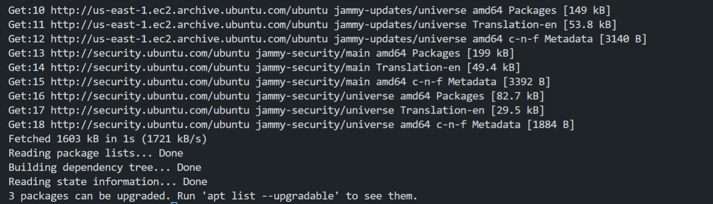


- upgrading the ubuntu server
    ```
    sudo apt-get upgrade
    ```
    Results:
    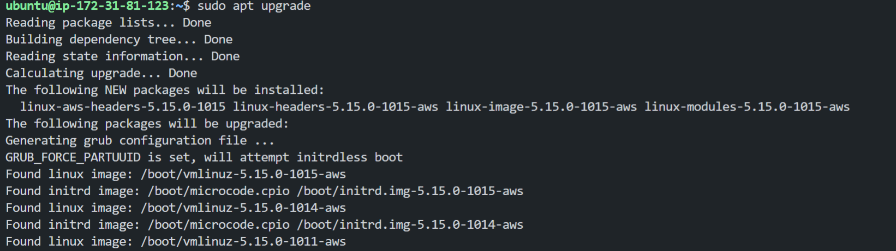

- Adding the required certificates
    ```
    sudo apt -y install curl dirmngr apt-transport-https lsb-release ca-certificates

    curl -sL https://deb.nodesource.com/setup_12.x | sudo -E bash -
    ```
    Results:
    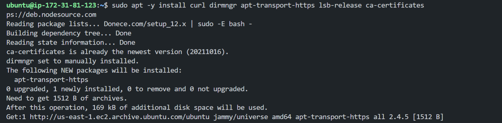


    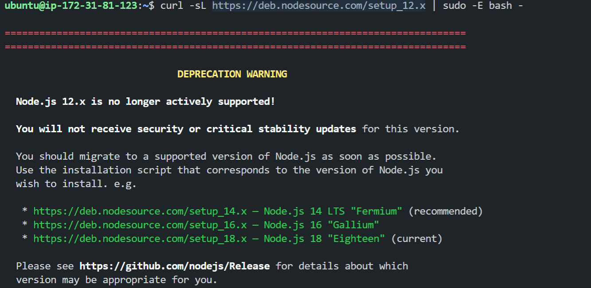

- Installing NodeJs
    ```
    sudo apt-get install nodejs
    ```
    Results:
    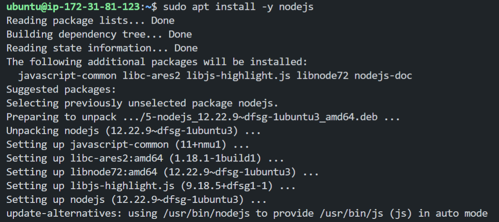

Now that were done with the primary steps of installing Node.js, we can move on to the next step of installing MongoDB.

## Installing MongoDB
MongoDB stores data in flexible, JSON-like documents. Fields in a database can vary from document to document and data structure can be changed over time. For our example application, we are adding book records to MongoDB that contain book name, isbn number, author, and number of pages.
images/WebConsole.gif

- installing mongodb key configurations settings
    ```
    sudo apt-key adv --keyserver hkp://keyserver.ubuntu.com:80 --recv 0C49F3730359A14518585931BC711F9BA15703C6
    ```
    and then running this command to add the repository to the list of repositories:
    ```
    echo "deb [ arch=amd64 ] https://repo.mongodb.org/apt/ubuntu trusty/mongodb-org/3.4 multiverse" | sudo tee /etc/apt/sources.list.d/mongodb-org-3.4.list
    ```
    Results:
    

    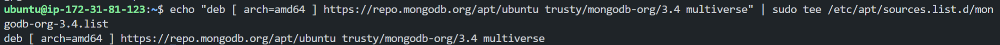

- Installing MongoDB
    ```
    sudo apt-get install -y mongodb
    ```
    Note: if you are using the latest version of ubuntu jammy you can use the following command instead of the previous one:
    ```
    sudo apt install gnupg
    echo "deb http://security.ubuntu.com/ubuntu impish-security main" | sudo tee /etc/apt/sources.list.d/impish-security.list

    sudo apt-get update

    sudo apt-get install libssl1.1
    ```
    and import the public key using this command
    ```
    wget -qO - https://www.mongodb.org/static/pgp/server-5.0.asc | sudo apt-key add -
    ```
    and add mongodb to the sources list and then install mongodb
    ```
    echo "deb [ arch=amd64,arm64 ] https://repo.mongodb.org/apt/ubuntu focal/mongodb-org/5.0 multiverse" | sudo tee /etc/apt/sources.list.d/mongodb-org-5.0.list

    sudo apt update

    sudo apt install -y mongodb-org
    ```
    after installing enable mongodb using the command
    ```
    sudo systemctl enable mongod
    ```

    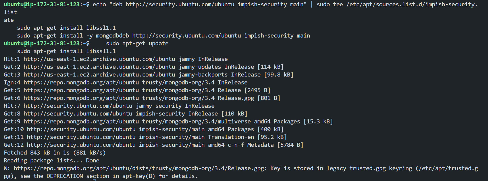

- Starting MongoDB
    ```
    sudo service mongod start
    ```
    Results:
    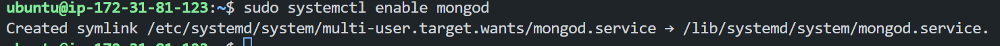

- Verifying that the service is up and running
    ```
    sudo systemctl status mongod
    ```
    Results:
    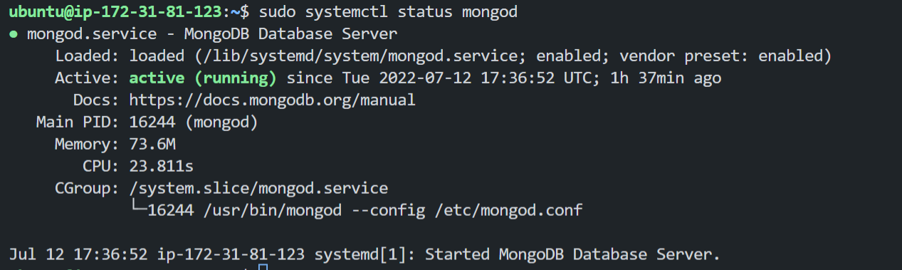

- Installing NPM - Node Package Manager
    ```
    sudo apt install -y npm
    ```
    Results:
    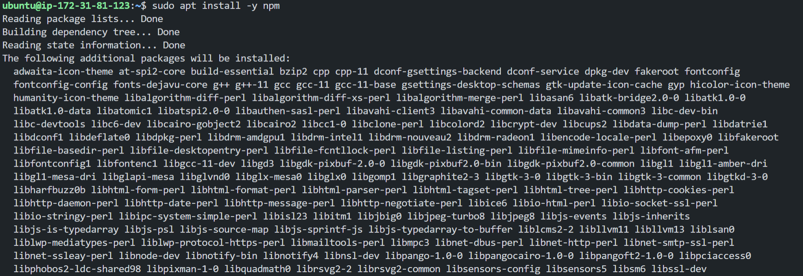

- Next we need to install body-parser package
    The ‘body-parser’ package to help us process JSON files passed in requests to the server.
    ```
    sudo npm install body-parser
    ```
    Results:
    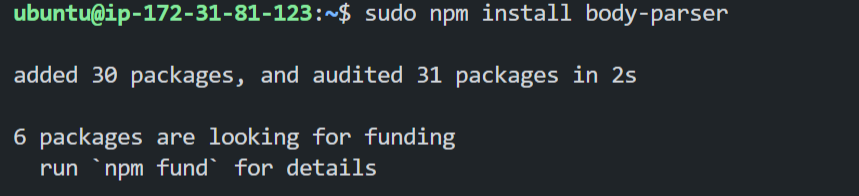

- creating a folder named books and navigating into the folder
    ```
    mkdir books && cd books
    ```
    Results:
    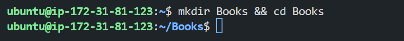

- In the Books directory, we need to Initialize npm project
    ```
    npm init
    ```
    Results:
    

- Add a file to it named server.js
    ```
    nano server.js
    ```
    and then add the following code to the server.js file:
    ```
    var express = require('express');
    var bodyParser = require('body-parser');
    var app = express();
    app.use(express.static(__dirname + '/public'));
    app.use(bodyParser.json());
    require('./apps/routes')(app);
    app.set('port', 3300);
    app.listen(app.get('port'), function() {
        console.log('Server up: http://localhost:' + app.get('port'));
    });
    ```
    Results:
    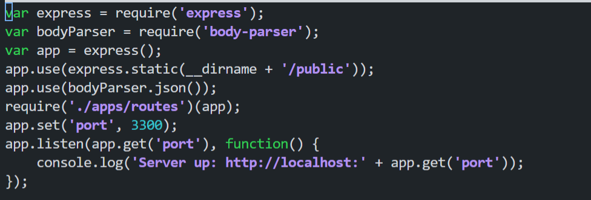

    
