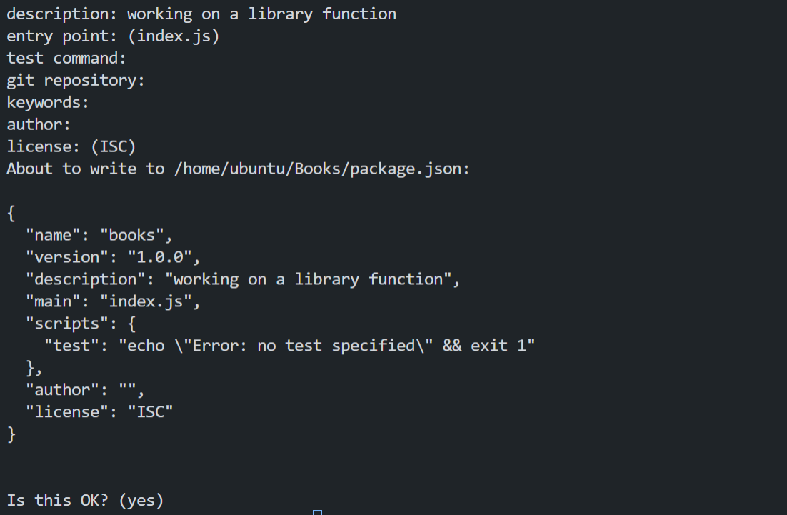

# Project 4 MEAN STACK DEPLOYMENT ON AWS

In this project we would be working on the following components of the MEAN stack:

- Installing NodeJs on our server.
- Installing MongoDB.
- Install Express and setting up routes to the server.
- Accessing the routes with AngularJS.

## Installing NodeJs on our server
Node.js is a JavaScript runtime built on Chrome’s V8 JavaScript engine. Node.js is used in this tutorial to set up the Express routes and AngularJS controllers.

- Updating the ubuntu server
    ```
    sudo apt-get update
    ```
    Results:
    


- upgrading the ubuntu server
    ```
    sudo apt-get upgrade
    ```
    Results:
    

- Adding the required certificates
    ```
    sudo apt -y install curl dirmngr apt-transport-https lsb-release ca-certificates

    curl -sL https://deb.nodesource.com/setup_12.x | sudo -E bash -
    ```
    Results:
    


    

- Installing NodeJs
    ```
    sudo apt-get install nodejs
    ```
    Results:
    

Now that were done with the primary steps of installing Node.js, we can move on to the next step of installing MongoDB.

## Installing MongoDB
MongoDB stores data in flexible, JSON-like documents. Fields in a database can vary from document to document and data structure can be changed over time. For our example application, we are adding book records to MongoDB that contain book name, isbn number, author, and number of pages.
images/WebConsole.gif

- installing mongodb key configurations settings
    ```
    sudo apt-key adv --keyserver hkp://keyserver.ubuntu.com:80 --recv 0C49F3730359A14518585931BC711F9BA15703C6
    ```
    and then running this command to add the repository to the list of repositories:
    ```
    echo "deb [ arch=amd64 ] https://repo.mongodb.org/apt/ubuntu trusty/mongodb-org/3.4 multiverse" | sudo tee /etc/apt/sources.list.d/mongodb-org-3.4.list
    ```
    Results:
    

    

- Installing MongoDB
    ```
    sudo apt-get install -y mongodb
    ```
    Note: if you are using the latest version of ubuntu jammy you can use the following command instead of the previous one:
    ```
    sudo apt install gnupg
    echo "deb http://security.ubuntu.com/ubuntu impish-security main" | sudo tee /etc/apt/sources.list.d/impish-security.list

    sudo apt-get update

    sudo apt-get install libssl1.1
    ```
    and import the public key using this command
    ```
    wget -qO - https://www.mongodb.org/static/pgp/server-5.0.asc | sudo apt-key add -
    ```
    and add mongodb to the sources list and then install mongodb
    ```
    echo "deb [ arch=amd64,arm64 ] https://repo.mongodb.org/apt/ubuntu focal/mongodb-org/5.0 multiverse" | sudo tee /etc/apt/sources.list.d/mongodb-org-5.0.list

    sudo apt update

    sudo apt install -y mongodb-org
    ```
    after installing enable mongodb using the command
    ```
    sudo systemctl enable mongod
    ```

    

- Starting MongoDB
    ```
    sudo service mongod start
    ```
    Results:
    

- Verifying that the service is up and running
    ```
    sudo systemctl status mongod
    ```
    Results:
    

- Installing NPM - Node Package Manager
    ```
    sudo apt install -y npm
    ```
    Results:
    

- Next we need to install body-parser package
    The ‘body-parser’ package to help us process JSON files passed in requests to the server.
    ```
    sudo npm install body-parser
    ```
    Results:
    

- creating a folder named books and navigating into the folder
    ```
    mkdir books && cd books
    ```
    Results:
    

- In the Books directory, we need to Initialize npm project
    ```
    npm init
    ```
    Results:
    

- Add a file to it named server.js
    ```
    nano server.js
    ```
    and then add the following code to the server.js file:
    ```
    var express = require('express');
    var bodyParser = require('body-parser');
    var app = express();
    app.use(express.static(__dirname + '/public'));
    app.use(bodyParser.json());
    require('./apps/routes')(app);
    app.set('port', 3300);
    app.listen(app.get('port'), function() {
        console.log('Server up: http://localhost:' + app.get('port'));
    });
    ```
    Results:
    

##  Install Express and setting up routes to the server.
Now that we've created our server, we need to install the Express framework and set up the routes to the server.

Express is a minimal and flexible Node.js web application framework that provides features for web and mobile applications. We will use Express in to pass book information to and from our MongoDB database.

We also will use Mongoose package which provides a straight-forward, schema-based solution to model your application data. We will use Mongoose to establish a schema for the database to store data of our book register.

- Installing Express and Mongoose
    ```
    sudo npm install express mongoose
    ```
    Results:
    

- In ‘Books’ folder, create a folder named apps
    ```
    mkdir apps && cd apps
    ```
    Results:
    

- Now we need to create a file called routes.js
    ```
    nano routes.js
    ```
    and then add the following code to the routes.js file:
    ```
    var Book = require('./models/book');
    module.exports = function(app) {
    app.get('/book', function(req, res) {
        Book.find({}, function(err, result) {
        if ( err ) throw err;
        res.json(result);
        });
    }); 
    app.post('/book', function(req, res) {
        var book = new Book( {
        name:req.body.name,
        isbn:req.body.isbn,
        author:req.body.author,
        pages:req.body.pages
        });
        book.save(function(err, result) {
        if ( err ) throw err;
        res.json( {
            message:"Successfully added book",
            book:result
        });
        });
    });
    app.delete("/book/:isbn", function(req, res) {
        Book.findOneAndRemove(req.query, function(err, result) {
        if ( err ) throw err;
        res.json( {
            message: "Successfully deleted the book",
            book: result
        });
        });
    });
    var path = require('path');
    app.get('*', function(req, res) {
        res.sendfile(path.join(__dirname + '/public', 'index.html'));
    });
    };
    ```
    Results:
    

- In the ‘apps’ folder, create a folder named models
    as this would hold all the models for the application.
    ```
    mkdir models && cd models
    ```
    Results:
    

- In our models folder create a file named book.js
    ```
    nano book.js
    ```
    and then add the following code to the book.js file:
    ```
    var mongoose = require('mongoose');
    var dbHost = 'mongodb://localhost:27017/test';
    mongoose.connect(dbHost);
    mongoose.connection;
    mongoose.set('debug', true);
    var bookSchema = mongoose.Schema( {
    name: String,
    isbn: {type: String, index: true},
    author: String,
    pages: Number
    });
    var Book = mongoose.model('Book', bookSchema);
    module.exports = mongoose.model('Book', bookSchema);
    ```
    Results:
    

## Accessing the routes with AngularJS
AngularJS provides a web framework for creating dynamic views in your web applications. In this tutorial, we use AngularJS to connect our web page with Express and perform actions on our book register.

- Now we need to change the directory back to ‘Books’
    ```
    cd ../..
    ```
    Results:
    

- In the books directory, create a folder named public and navigate into it.
    ```
    mkdir public && cd public
    ```
    Results:
    

- Then in the public directory, create a file script.js
    ```
    nano script.js
    ```
    and then add the following code to the script.js file:
    ```
    var app = angular.module('myApp', []);
    app.controller('myCtrl', function($scope, $http) {
    $http( {
        method: 'GET',
        url: '/book'
    }).then(function successCallback(response) {
        $scope.books = response.data;
    }, function errorCallback(response) {
        console.log('Error: ' + response);
    });
    $scope.del_book = function(book) {
        $http( {
        method: 'DELETE',
        url: '/book/:isbn',
        params: {'isbn': book.isbn}
        }).then(function successCallback(response) {
        console.log(response);
        }, function errorCallback(response) {
        console.log('Error: ' + response);
        });
    };
    $scope.add_book = function() {
        var body = '{ "name": "' + $scope.Name + 
        '", "isbn": "' + $scope.Isbn +
        '", "author": "' + $scope.Author + 
        '", "pages": "' + $scope.Pages + '" }';
        $http({
        method: 'POST',
        url: '/book',
        data: body
        }).then(function successCallback(response) {
        console.log(response);
        }, function errorCallback(response) {
        console.log('Error: ' + response);
        });
    };
    });
    ```
    Results:
    

- In the public directory create a file called index.html
    ```
    nano index.html
    ```
    and then add the following code to the index.html file:
    ```
    <!doctype html>
    <html ng-app="myApp" ng-controller="myCtrl">
    <head>
        <script src="https://ajax.googleapis.com/ajax/libs/angularjs/1.6.4/angular.min.js"></script>
        <script src="script.js"></script>
    </head>
    <body>
        <div>
        <table>
            <tr>
            <td>Name:</td>
            <td><input type="text" ng-model="Name"></td>
            </tr>
            <tr>
            <td>Isbn:</td>
            <td><input type="text" ng-model="Isbn"></td>
            </tr>
            <tr>
            <td>Author:</td>
            <td><input type="text" ng-model="Author"></td>
            </tr>
            <tr>
            <td>Pages:</td>
            <td><input type="number" ng-model="Pages"></td>
            </tr>
        </table>
        <button ng-click="add_book()">Add</button>
        </div>
        <hr>
        <div>
        <table>
            <tr>
            <th>Name</th>
            <th>Isbn</th>
            <th>Author</th>
            <th>Pages</th>

            </tr>
            <tr ng-repeat="book in books">
            <td>{{book.name}}</td>
            <td>{{book.isbn}}</td>
            <td>{{book.author}}</td>
            <td>{{book.pages}}</td>

            <td><input type="button" value="Delete" data-ng-click="del_book(book)"></td>
            </tr>
        </table>
        </div>
    </body>
    </html>
    ```
    Results:
    

- Change the directory back up to Books
    ```
    cd ..
    ```
    Results:
    

- Start the server by running this command:
    ```
    node server.js
    ```
    Results:
    

- The server is now up and running, we can connect it via port 3300. You can launch a separate Putty or SSH console to test what curl command returns locally.
    ```
    curl -s http://localhost:3300
    ```
    Results:
    

- Expose the tcp 3300 port on your system and then get the public ip address of your system.
    ```
     curl -s http://169.254.169.254/latest/meta-data/public-ipv4 
    ```
    Results:
    