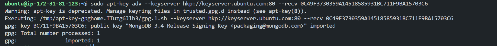

# Project 4 MEAN STACK DEPLOYMENT ON AWS

In this project we would be working on the following components of the MEAN stack:

- Installing NodeJs on our server.
- Installing MongoDB.
- Install Express and setting up routes to the server.
- Accessing the routes with AngularJS.

## Installing NodeJs on our server
Node.js is a JavaScript runtime built on Chrome’s V8 JavaScript engine. Node.js is used in this tutorial to set up the Express routes and AngularJS controllers.

- Updating the ubuntu server
    ```
    sudo apt-get update
    ```
    Results:
    


- upgrading the ubuntu server
    ```
    sudo apt-get upgrade
    ```
    Results:
    

- Adding the required certificates
    ```
    sudo apt -y install curl dirmngr apt-transport-https lsb-release ca-certificates

    curl -sL https://deb.nodesource.com/setup_12.x | sudo -E bash -
    ```
    Results:
    


    

- Installing NodeJs
    ```
    sudo apt-get install nodejs
    ```
    Results:
    

Now that were done with the primary steps of installing Node.js, we can move on to the next step of installing MongoDB.

## Installing MongoDB
MongoDB stores data in flexible, JSON-like documents. Fields in a database can vary from document to document and data structure can be changed over time. For our example application, we are adding book records to MongoDB that contain book name, isbn number, author, and number of pages.
images/WebConsole.gif

- installing mongodb key configurations settings
    ```
    sudo apt-key adv --keyserver hkp://keyserver.ubuntu.com:80 --recv 0C49F3730359A14518585931BC711F9BA15703C6
    ```
    and then running this command to add the repository to the list of repositories:
    ```
    echo "deb [ arch=amd64 ] https://repo.mongodb.org/apt/ubuntu trusty/mongodb-org/3.4 multiverse" | sudo tee /etc/apt/sources.list.d/mongodb-org-3.4.list
    ```
    Results:
    

    